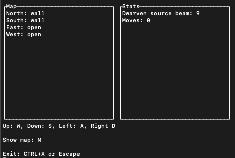
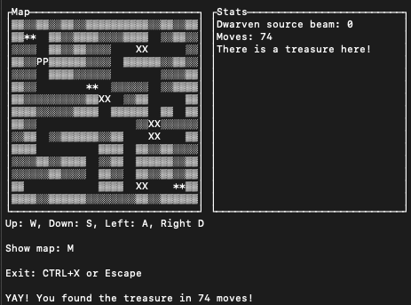

# Dwarven Stronghold

This is my version of the game Stronghold of the Dwavern Lords from the The GIANT Book of Games for the Dick Smith Electronics VZ300 Personal Colour Computer that was written by Tim Hartnell and published in 1986.

The book was a collection of games written in BASIC which you would manually type in one line at a time before you could run the program to see if you'd made any typos or syntax errors, and all going to plan, you'd get to play a game!

I remember it fondly, and when we found the book recently, I decided to dig it out and re-implement my favourite game from the book in object-oriented Ruby as a command-line program.

## VZ300

The [Dick Smith VZ300](https://en.wikipedia.org/wiki/VTech_Laser_200#Laser_310_/_VZ_300) had a Z80 CPU, 16 _kilobytes_ of RAM, and 2 KB of video RAM.

It used cassette tapes for permanent storage, which took several minutes to store or retrieve even small BASIC programs, or not at all when someone had recorded Bon Jovi over a masterpiece you'd spent days working on :) 

## Installation

* Glone the repo
* Install the rubygem dependencies with `bundle install`
* Launch the game with `ruby launcher.rb`

## Gameplay

The snyposis from the book:

> Deep beneath the earth you go, far into the Dwarven Heartland. Danger is on every side as you descend, but your greed draws you on. Searching through the dusty stacks of uncatalogued manuscripts in room 546B of the British Museum, you came across a faded, and almost illegible map to a Dwarven hoard of gold, and since that day, you have been obsessed with the idea of finding it.
> 
> As you go down into the labyrinth, you realise that the Dwarven Lords, who secreted the gold here 7389 years ago, have long since become extinct, so the main danger you face is from the layout of the cavern system itself, rather than from the Guards of the Stronghold.
> 
> In Stronghold of the Dwarven Lords you are in a cavern which holds the gold. Each time you play this game, the gold can be in one of three places. The only information you get as to your progress is information provided by the **Dwarven Source Beam** which you found as you made your way into the cavern system. This gives you feedback after each move as to the location of the gold, but you need to learn how to interpret the information it gives you before you'll be able to make much use of it.

The original game is a simple text-based adventure that describes your environment and allows you to navigate with keyboard commands, giving you an updated reading on the dwarven source beem as you go, until you ultimately discover the dwarven hoard.

In my version, I've presented the directions in a pane on the left, and the dwarven source beam stats in a pane on the right:

The **lower** the dwarven source beam reads, the **closer** you are to finding the treasure.

Attempting to find the treasure using only the description of your environment and strength of the dwarven source beem as you go is actually quite challenging! The original game has a move limit, which is penalised when viewing the map.

In my version you _can_ view the map at any time by pressing "m", but I haven't implemented the move penalty yet. The game is best enjoyed without relying on the map to navigate the labyrinth. In one iteration of the game I presented a live rogue-like map, but found it all but removed the challenge completely.

When you finally find the treasure, the map is revealed:

Legend:

* `**` - items
* `PP` - the player _(you)_
* `XX` - monsters

The original game partially randomises the location of the player by picking one of three pre-determined map coordinates, but I've fully randomised the locations of both the player and the treasure, and also added nondescript items _(that don't currently do anything)_, as well as monsters that currently just wander around but don't engage you with a combat system, yet.

## Todo:

- [X] Implement the non-map view
- [X] Items
- [ ] Item inventory
- [ ] Item properties, effects on gameplay
- [X] Monsters!
- [ ] Monster combat system
- [ ] Random map?
- [ ] Bigger map?
